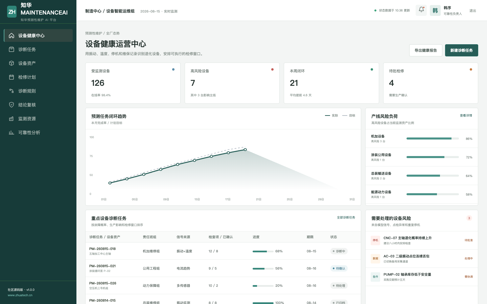
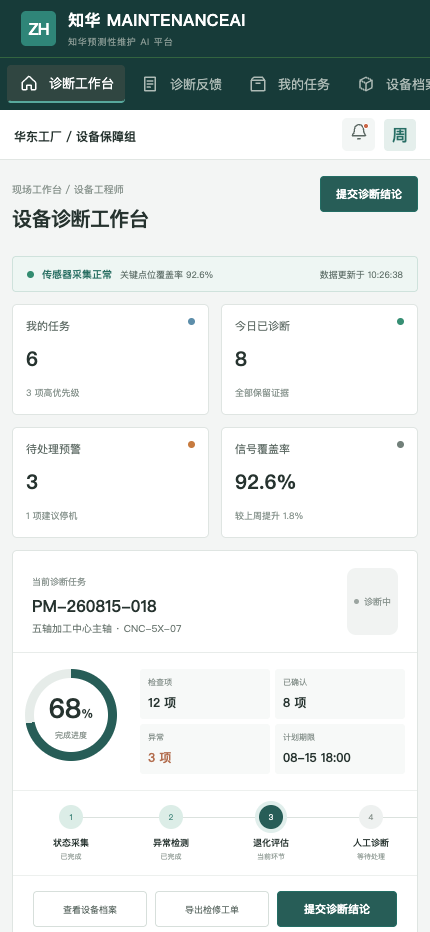

# ZhuaTech MaintenanceAI · 知华预测性维护 AI 平台

> 让设备在故障发生前，给出可解释的信号。

[](backend/pom.xml)
[](backend/pom.xml)
[](frontend/package.json)
[](compose.yaml)
[](LICENSE)

ZhuaTech MaintenanceAI 是 **[知华科技（上海如静知华信息科技有限公司）](https://www.zhuatech.cn/)** 发布的预测性维护社区源码项目。它把设备台账、状态监测、故障履历、诊断任务和检修复盘连接起来，适合个人学习工业 AI、设备健康管理、Java AI 工程和 Vue 企业系统。

## 产品工作面



管理端集中呈现受监测设备、高风险资产、预测闭环、产线负荷和待批准检修，面向设备经理、可靠性工程师与生产负责人。



业务端面向点检与维修人员，提供诊断任务、原始信号、设备履历、风险升级和现场反馈。

## 核心能力

- 设备、部件、传感器与维护履历台账
- 振动、温度、故障次数、健康指数和运行时长综合评估
- `CRITICAL / WATCH / STABLE` 风险分层及建议检修时间
- 原始证据、模型置信度和人工诊断结论并存
- 检修窗口、工单回写和维护效果复盘
- 管理端与响应式 H5 双工作台

参考接口 `POST /api/ai/maintenance/predict` 完全本地运行，不需要任何外部模型密钥。生产环境可替换为企业自有时序模型，但停机建议仍应经过生产与设备人员批准。

## 技术结构

| 层次 | 实现 |
| --- | --- |
| Web / H5 | Vue 3、Pinia、Vue Router、Axios、Vite |
| Java API | Java 21、Spring Boot 4、JWT、JPA、Bean Validation |
| AI 策略 | 可测试的设备退化评分、证据解释与人工安全门禁 |
| 数据 | MySQL 8、Flyway；测试环境使用 H2 |
| 交付 | Docker Compose、Nginx、CI、API 与架构文档 |

Java 根包为 `cn.zhuatech.maintenanceai`。

## 本地体验

```bash
cd frontend
npm install
npm run dev:demo
```

访问 `http://localhost:5173`。管理端演示账号 `planner / Demo@2026`，业务端账号 `operator / Demo@2026`。完整容器启动见 [deploy/README.md](deploy/README.md)，接口见 [docs/api.md](docs/api.md)。演示设备、人员和风险数据均为虚构信息。

## 使用许可与商业授权

本工程仅允许个人、非商业性的学习、研究与技术交流，**不得商用**。企业内部使用、生产部署、SaaS、项目交付、收费服务、品牌替换或二次销售，必须事先取得上海如静知华信息科技有限公司书面授权。完整条款以 [LICENSE](LICENSE) 为准。

预测性维护咨询、工业数据接入、模型私有化、OPC 技术支持和深度开发定制，请访问[知华科技官网](https://www.zhuatech.cn/)或扫码联系：

| 技术与方案咨询 | 商业授权及定制 |
| --- | --- |
|  |  |

SEO：预测性维护、设备健康管理、故障预测、工业 AI、Java 预测性维护源码、OPC 数据采集、知华科技、上海如静知华信息科技有限公司。
